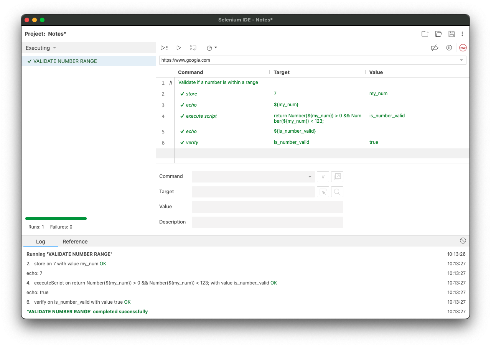

# selenium_ide_notes


My personal Selenium IDE notes.

---


<!--- ####### INDEX ####### --->
**Index**
1. [VALIDATE](#validate)
    - [Number](#number)
        - [Range](#range)
    - [Date](#date)
        - [From today](#date-from-today)
        - [Formats](#formats)
2. [RegEx](#regex)
    - [How to use](#how-to-use)
    - [Examples](#examples)
3. [COMPARE](#compare)
4. [LOOP](#loop)
    - [TIMES](#times)
    - [~~TIMES nested~~](#times-nested)
    - [DO...REPEAT IF nested](#dorepeat-if-nested)
    - [DO...REPEAT IF nested in TIMES](#dorepeat-if-nested-in-times)


[⬆](#)
<!--- ####### START - VALIDATE ####### --->
## VALIDATE 

### Number 

-  #### Range
    Validate that the given number is within the range.

    ```js
    return Number(${my_num}) > 0 && Number(${my_num}) < 123;
    ```

    Example of how to use the ***number range*** validation.
    <!-- //TODO: Add image with example -->
    

### Date
- #### From today
    Validate that the given date is greater than or equal to the current date.

    ```js
    return ${my_date_formatted} >= ${today_date};
    ```

    Example of how to use the ***date from today*** validation.
    <!-- //TODO: Add image with example -->
    

- #### Formats
    Examples to format the date in JS format

    ```js
    // Example: Jan/17/2024

    return new Date(${my_date}.replace(/(\w+)\/(\d+)\/(\d+)/, '$1 $2, $3'));
    ```

<!--- ####### END - VALIDATE ####### --->

[⬆](#)

<!--- ####### START - REGEX ####### --->
## RegEx 

- ### How to use
    Replace the script with the desired regular expression.

    Example of how to use the ***RegEx Tester***.
    <!-- //TODO: Add image with example -->
    

- ### Examples
    <details>
    <summary>Examples of RegEx and their valid strings.</summary>
  
    

    ```js
    // For: '$ 10 USD', '$ 3.50 USD', '$ 0.25 USD', '$ 12345.67 USD'

    return /^\$ ([1-9]\d*|\d+\.\d+) USD$/g.test(${SAMPLE_TEXT})
    ```

    ```js
    // For: '10 USD', '3.50 MXN', '1000 USD', '0.25 MXN', 'N/A'

    return /^(([1-9]\d*|\d+\.\d+) (?:USD|MXN))?$|^N\/A$/g.test(${SAMPLE_TEXT});
    ```

    ```js
    // For: '10', '3.50', '1000', '0.25', 'N/A'

    return /^(([1-9]\d*|\d+\.\d+))?$|^N\/A$/g.test(${SAMPLE_TEXT});
    ```

    ```js
    // For: ''

    return ;
    ```
    </details>


<!--- ####### END - REGEX ####### --->

[⬆](#)

<!--- ####### START - COMPARE ####### --->
## COMPARE 

- ### IF

    #### includes
    Example of how to use the ***includes JS*** in an if.

    ```js
    ${text}.includes("Container Size:")
    ```
    <!-- //TODO: Add image with example -->
    


<!--- ####### END - COMPARE ####### --->

[⬆](#)

<!--- ####### START - LOOP ####### --->
## LOOP 

<!--- --->
- ### TIMES
    
    Example of how to use the ***times*** loop.
    <!-- //TODO: Add image with example -->
    

<!--- --->
- ### ~~TIMES nested~~
    
    ~~Example of how the ***times*** loop should be used. But there is a bug that does not allow the correct use of this functionality.~~

    <!-- //TODO: Add image with example -->
    ~~~~

<!--- --->
- ### DO...REPEAT IF nested
    Example of how to use the ***do...repeat if*** loop.

    <!-- //TODO: Add image with example -->
    

<!--- --->
- ### DO...REPEAT IF nested in TIMES
    
    Example of how to use the ***times*** loop.
    <!-- //TODO: Add image with example -->
    

<!--- ####### END - LOOP ####### --->

[⬆](#)